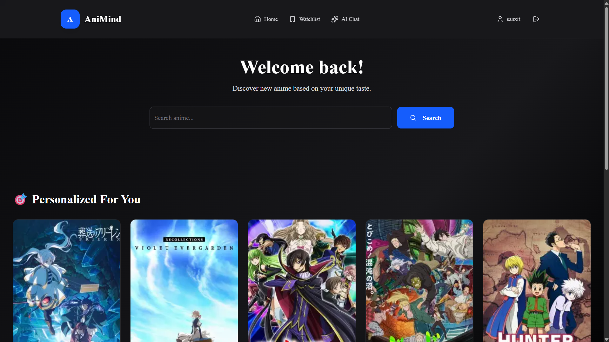
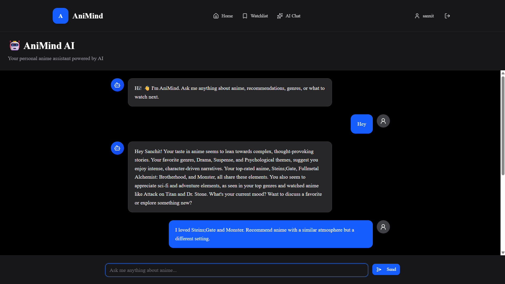
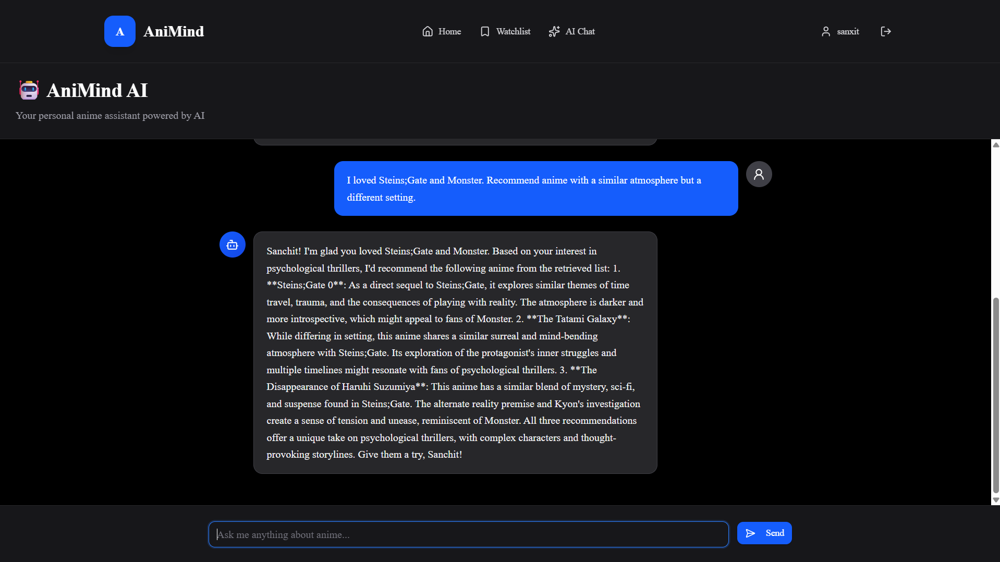
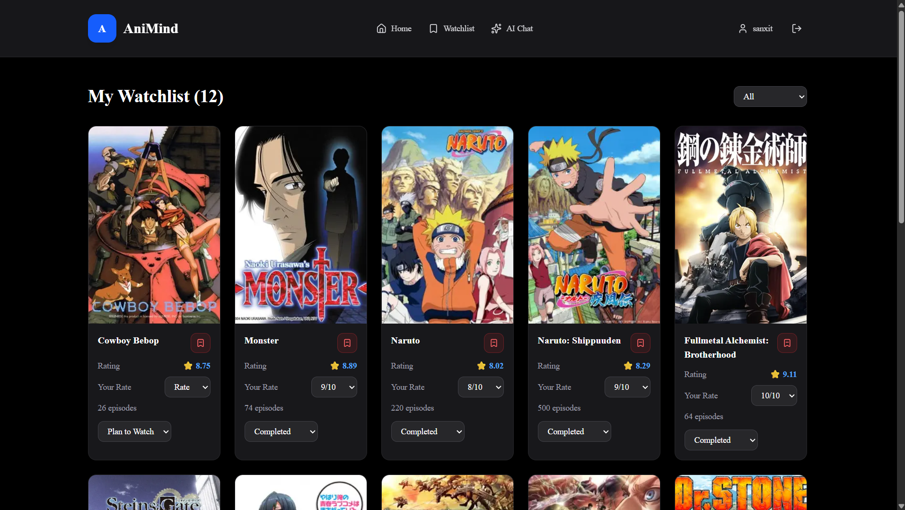
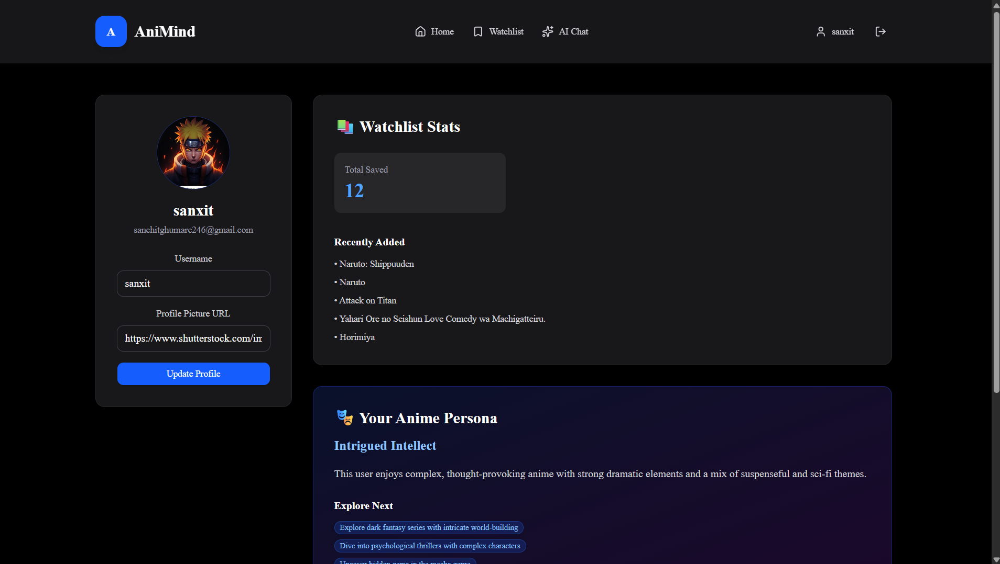
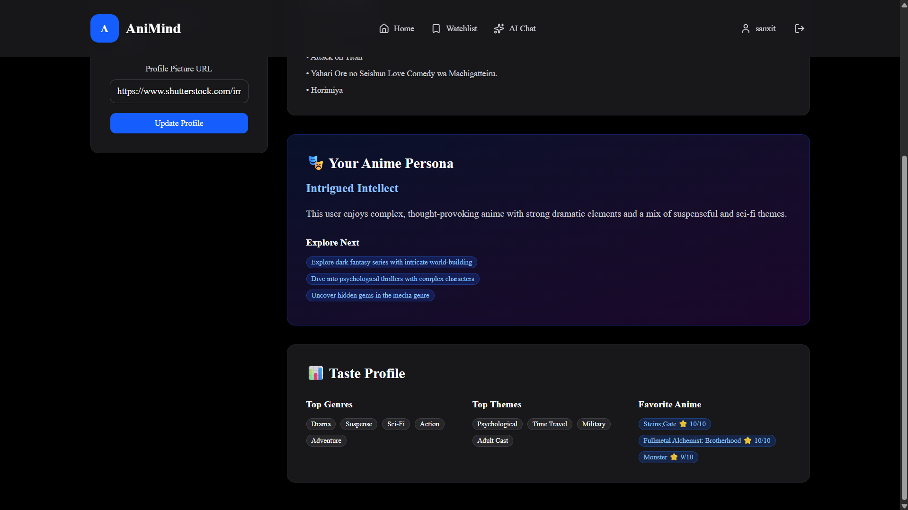
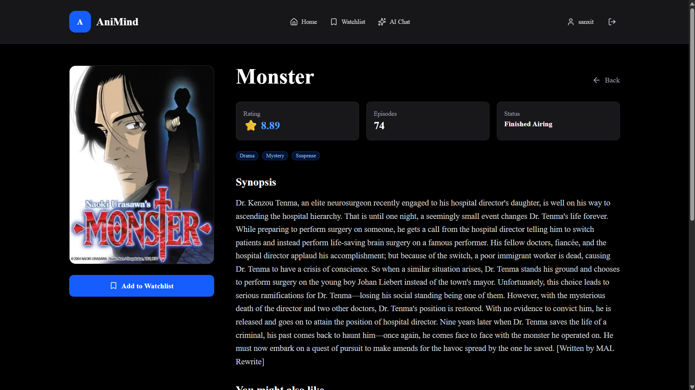

# 🎌 AniMind

**AniMind** is an AI-powered anime recommendation platform that goes beyond traditional anime databases by providing personalized recommendations, conversational AI, long-term memory, and intelligent watchlist management.

🌐 **Live Demo:** https://ani-mind-nine.vercel.app

---

## ✨ Features

### 🤖 AI Anime Assistant

- Conversational AI powered by LLMs
- Answers anime-related questions
- Personalized responses using your anime taste
- Remembers important information across conversations

---

### 🎯 Personalized Recommendations

- AI-generated recommendations based on:
  - Favorite anime
  - Genres
  - Themes
  - User ratings
- Compatibility scoring
- Recommendation explanations
- Automatic regeneration when your taste profile changes

---

### 📚 Smart Watchlist

- Add anime using natural language
- Update watching status
- Rate anime
- Remove anime
- AI understands commands like:

> Add Naruto to my watchlist

> Rate Monster 10

> Mark Vinland Saga as completed

---

### 🧠 Long-Term Memory

AniMind remembers meaningful user information such as:

- Favorite genres
- Preferences
- Goals
- Personal facts

while ignoring temporary conversation.

---

### 🔍 Intelligent Anime Search

- Search anime using Jikan API
- Local MongoDB caching
- Automatic database expansion
- Detailed anime pages

---

### 👤 Personalized Taste Profile

Automatically generates:

- Favorite genres
- Favorite themes
- Top-rated anime
- AI summary of your taste
- Recommendation directions

---

### 🔒 Authentication

- GitHub OAuth
- Secure sessions with NextAuth

---

### ⚡ Performance

- MongoDB indexing
- Recommendation caching
- Redis rate limiting
- Optimized API usage

---

## 🏗 Architecture

AniMind uses a planner-executor architecture.

```
                     ┌─────────────── Client ───────────────┐
                     │                                      │
                     │     Next.js + React + Tailwind       │
                     └───────────────────┬──────────────────┘
                                         │
                                         ▼
                              API Route (/api/chat)
                                         │
                                         ▼
                           Planner (LLM Decision Layer)
                                         │
                 ┌───────────────────────┼────────────────────────┐
                 │                       │                        │
                 ▼                       ▼                        ▼
           Tool Executor          Intent Router           Memory Manager
                 │                       │                        │
                 ▼                       ▼                        ▼
      Watchlist CRUD        Chat / Search / Recommend      Memory Extractor
                 │                       │                        │
                 └──────────────┬────────┴──────────────┬─────────┘
                                ▼                       ▼
                        MongoDB Atlas              Groq (Llama 4)
                                │
                                ▼
                           Jikan API Cache
```

## System Components

- **Planner** – Determines user intent, tool execution, and memory persistence.
- **Executor** – Executes watchlist actions using structured tool calls.
- **Intent Router** – Routes requests to Chat, Search, Recommendation, Profile, or Watchlist handlers.
- **Memory Manager** – Stores only meaningful long-term user information.
- **Recommendation Engine** – Uses taste profiles and watchlist history to personalize suggestions.
- **Anime Cache** – Stores anime fetched from Jikan in MongoDB to reduce external API calls.

---

## 🛠 Tech Stack

### Frontend

- Next.js 16
- React
- Tailwind CSS
- shadcn/ui

### Backend

- Next.js Route Handlers
- MongoDB Atlas
- Mongoose

### AI

- Groq
- Llama 4 Scout
- Prompt Engineering
- Planner–Executor Architecture
- Long-Term Memory

### Authentication

- NextAuth.js
- GitHub OAuth

### APIs

- Jikan API

### Infrastructure

- Upstash Redis
- Vercel

---

## 📸 Screenshots

### Home

 

### AI Chat
<p align="center">
  
  
</p>

### Watchlist



### Profile
<p align="center">
  
  
</p>

### Anime Details



---

## 🚀 Installation

Clone the repository

```bash
git clone https://github.com/yourusername/animind.git
```

Install dependencies

```bash
npm install
```

Create `.env.local`

```env
MONGODB_URI=

NEXTAUTH_URL=
NEXTAUTH_SECRET=

GITHUB_ID=
GITHUB_SECRET=

GROQ_API_KEY=
GROQ_MODEL=

UPSTASH_REDIS_REST_URL=
UPSTASH_REDIS_REST_TOKEN=
```

Run locally

```bash
npm run dev
```

---

## 📌 Future Improvements

- Streaming AI responses
- Progressive Web App (PWA)
- Push notifications
- Offline watchlist
- Better recommendation explanations
- Social features
- Anime collections

---

## 👨‍💻 Author

**Sanchit Ghumare**

GitHub: https://github.com/yourusername

---

## ⭐ If you found this project interesting, consider starring the repository!
